# GrandVista Hotel & Luxury Suites

A luxury 5-star heritage boutique hotel web application designed and built with semantic HTML5, modern CSS3, vanilla JavaScript (ES6+), and a lightweight, secure PHP 8.5 + MySQL 8.0 backend.

- **GitHub Repository:** [https://github.com/Vikranth-Kumar-Jakkoju/grandvista-hotel](https://github.com/Vikranth-Kumar-Jakkoju/grandvista-hotel)
- **Live Demo (Frontend Showcase):** [https://vikranth-kumar-jakkoju.github.io/grandvista-hotel/](https://vikranth-kumar-jakkoju.github.io/grandvista-hotel/) *(Note: Live demo showcases client-side features; full transactional booking, inquiries, and table reservations connect to the PHP/MySQL backend when running locally).*

---

## 📖 Description

GrandVista Hotel is an architectural icon located along Visakhapatnam's coast, blending 98+ years of heritage hospitality with contemporary luxury. This digital portal provides guests with an end-to-end booking experience, curated culinary discovery, local neighborhood guides, and immersive multimedia exploration.

The project is built entirely without bulky UI frameworks (no Bootstrap, React, or jQuery), ensuring ultra-fast load times, semantic accessibility, zero external client-side dependencies, and full responsiveness across all viewports (tested down to 375px and 320px mobile screens with zero horizontal overflow).

---

## ✨ Features

### 1. 23-Page Complete Digital Portal
1. **Homepage (`index.html`):** Hero showcase, booking availability widget, hotel heritage intro, featured accommodations, amenities highlight grid, and recently viewed tracker.
2. **Accommodations Catalog (`rooms.html`):** Multi-faceted room filtering (category, bed type, view, guest count, price range, and amenities), live sort dropdown (featured, price asc/desc, size), heart wishlist toggles, and availability badges.
3. **Room Details (`room-details.html?room=<slug>`):** Dynamic slug-driven template, full-featured lightbox gallery with thumbnail reel and touch/keyboard controls, guest specifications, policies, and booking jump cards.
4. **Multi-Step Booking Engine (`booking.html`):** 6-step guided reservation engine (Dates & Room selection, Guest details, Add-on services, Live financial breakdown, and Confirmation receipt).
5. **Special Offers & Packages (`offers.html`):** Curated seasonal packages, promo code copy buttons, discount details, and direct booking links.
6. **Dining & Culinary (`dining.html`):** Showcase of fine dining venues (The Grand Pavilion, Spice Symphony, Sky Lounge & Bar), venue hours, dress codes, and instant reservation modal.
7. **Restaurant Details (`restaurant-details.html?restaurant=<slug>`):** Venue details, chef's philosophy, categorized menus (appetizers, mains, desserts, drinks) with dietary tags, and an integrated table booking form.
8. **Location & Transit (`location.html`):** Hotel coordinates, OpenStreetMap interactive embed, transit hub distances (Airport, Railway Station, Bus Station, Beach Road), and 6 nearby attraction cards.
9. **Event Spaces & Banquets (`events.html`):** Architectural showcase of 3 distinguished event venues (The Grand Ballroom, The Diplomatic Hall, The Terrace Pavilion) with capacity breakdowns, audiovisual tech, and catering options.
10. **Venue Details & Floorplans (`event-details.html?slug=<slug>`):** Detailed floorplan layouts, seating specifications (theatre, classroom, banquet, cocktail), stage dimensions, and interactive event proposal request form.
11. **Guest Reviews & Testimonials (`reviews.html`):** 4.9/5 overall rating breakdown, verified reviews from diplomats and executives, category filters, and verified review submission engine.
12. **Editorial Blog & Travel Guide (`blog.html`):** 6 travel and lifestyle articles across categories with instant category filtering.
13. **Article Details (`blog-details.html?slug=<slug>`):** Slug-driven article reader with reading time, author, date, rich typography, related stories, and cross-links to hotel services (rooms, dining, offers).
14. **Hotel Amenities (`amenities.html`):** 6 facility highlights (Infinity Pool, Fitness Centre, Ayurvedic Spa, Business Centre, Valet Parking, Fiber Wi-Fi) with operating hours.
15. **Banquets & Facilities (`facilities.html`):** Event spaces, corporate meeting halls, wedding lawns, capacity charts, and event booking inquiry forms.
16. **Photo Gallery (`gallery.html`):** Category-filtered photo gallery with keyboard/swipe fullscreen lightbox.
17. **Heritage & Story (`about.html`):** Hotel narrative since 1928, milestones timeline, mission, and leadership.
18. **Frequently Asked Questions (`faq.html`):** ARIA-compliant accessible accordion answering common guest inquiries.
19. **Contact & Concierge (`contact.html`):** Department directory, front desk coordinates, and validated inquiry form.
20. **Hotel Policies (`policies.html`):** Transparent guidelines on check-in/out, cancellations, children, pets, smoking, and identity verification.
21. **Saved Wishlist (`wishlist.html`):** LocalStorage-backed saved rooms collection with real-time navigation badge sync.
22. **Privacy Policy (`privacy.html`):** Guest data privacy disclosures, GDPR/DPDP alignment, and cookie policies.
23. **Terms of Service (`terms.html`):** Reservation terms, liability limits, and stay conditions.

### 2. Multi-Step Booking & Server-Side Security
- **Server-Side Recalculation:** All financial math (room price per night, nights count, add-on services subtotals, 18% GST tax rate, and grand total) is validated and computed strictly on the server (`backend/api/booking.php`). Tampered client prices are completely ignored.
- **Pending Confirmation Status:** New bookings are securely inserted with `status = 'pending'`, generating an alphanumeric booking reference (`GVH-2026-XXXXX`).
- **Input Validation:** Server-side sanitization and validation for names, phone numbers, email regex, date chronometry (check-out must be after check-in, no past dates), and guest counts.

### 3. SEO & Standards Compliance
- **SEO Elements:** Every page contains a unique `<title>`, unique `<meta name="description">`, `<link rel="canonical">`, and exactly one `<h1>`.
- **Search Engine Assets:** Complete [sitemap.xml](sitemap.xml) and [robots.txt](robots.txt) indexing all 23 pages.
- **Mobile First & Responsive:** Tested and verified at mobile viewports (375px / 390px) with 0 horizontal scroll (`scrollWidth == innerWidth`).

---

## 🛠️ Technologies Used

- **Frontend:**
  - Semantic **HTML5**
  - Modern **CSS3** (CSS Variables, Flexbox, CSS Grid, media queries)
  - Vanilla **JavaScript (ES6+)** (No third-party libraries, Fetch API, LocalStorage, Custom Events, URLSearchParams)
- **Backend:**
  - **PHP 8.5+** (Modular RESTful API endpoints in `backend/api/`)
  - **PDO MySQL** with prepared statements for SQL injection prevention
  - Clean JSON responses (`{ success, message, data, errors }`) and semantic HTTP status codes (200, 201, 400, 404, 405, 500)
- **Database:**
  - **MySQL 8.0** relational database (`grandvista_hotel`)
  - Normalized tables: `rooms`, `bookings`, `booking_services`, `enquiries`, `table_reservations`, `restaurants`, `menu_items`, `offers`, `events`, `event_images`, `event_enquiries`, `reviews`
  - Canonical schema in `backend/sql/schema.sql` and Phase 1 migration in `backend/sql/002_events_reviews.sql`
- **Development & Version Control:**
  - Git & GitHub
  - Built-in PHP Development Server (`php -S localhost:8000`)

---

## 📸 Screenshots

All screenshots are stored in the `/screenshots` directory.

### Desktop Previews (1280px Viewport)

| Homepage | Accommodations |
| :---: | :---: |
| 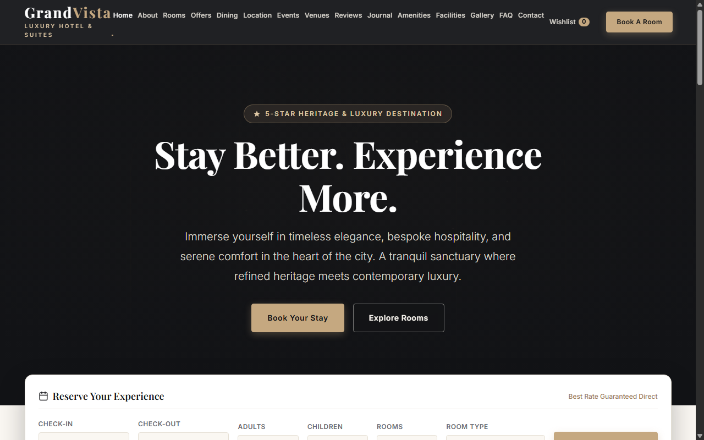 | 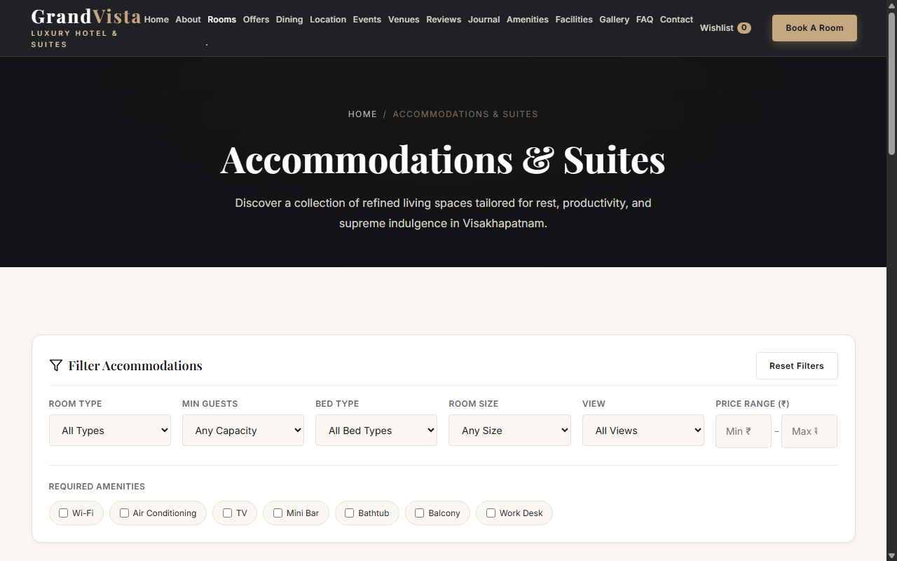 |

| Multi-Step Booking Engine | Dining Venues |
| :---: | :---: |
| 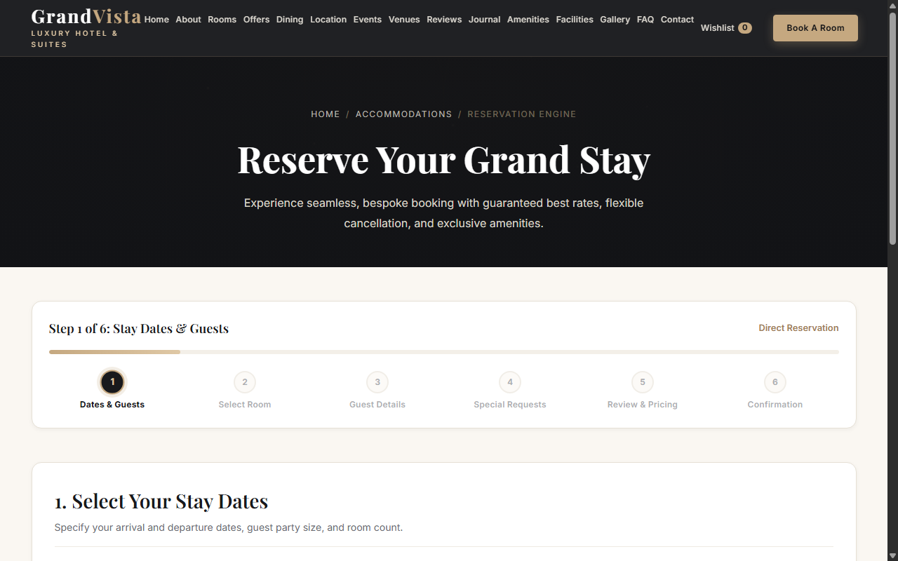 | 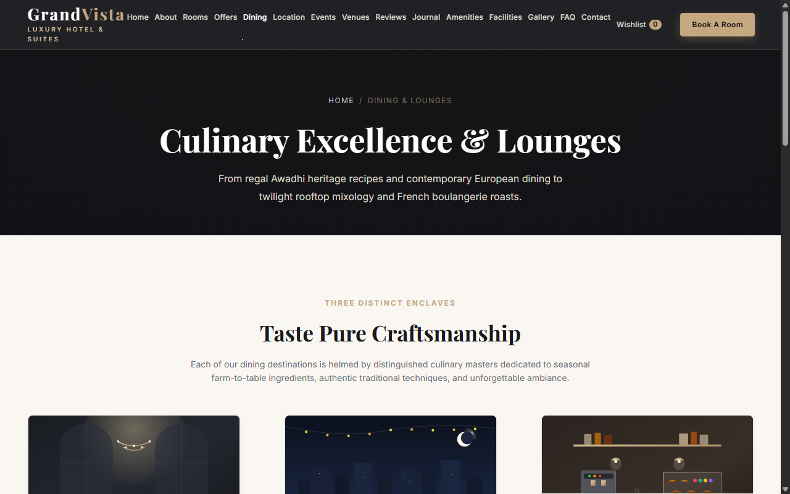 |

| Location & Nearby Attractions | Editorial Travel Blog |
| :---: | :---: |
| 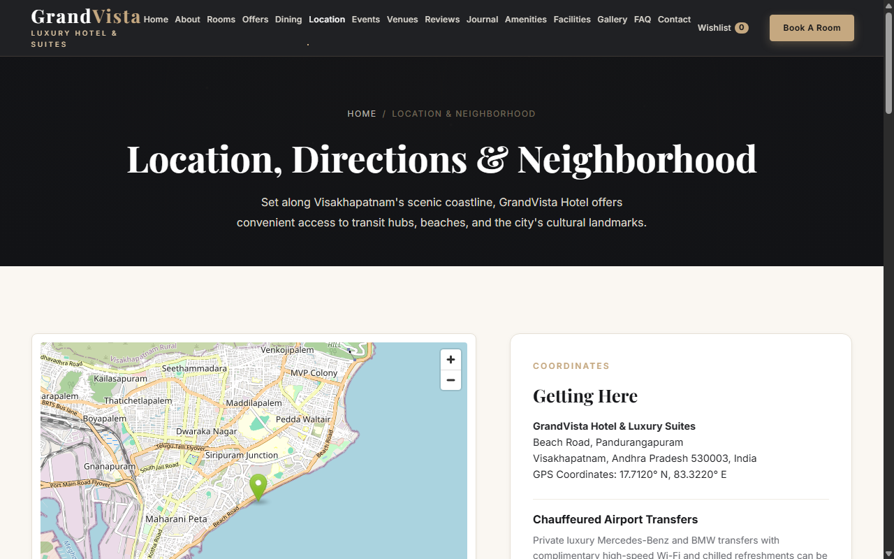 | 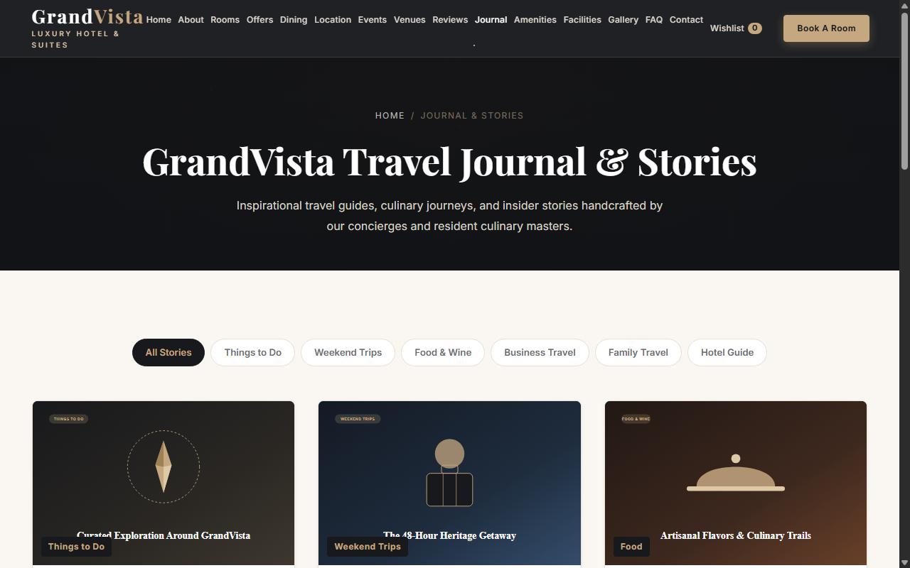 |

| Blog Article Details | Legal Policies |
| :---: | :---: |
| 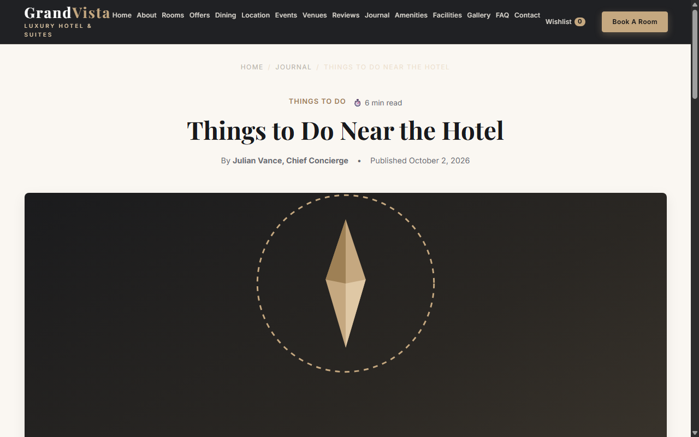 | 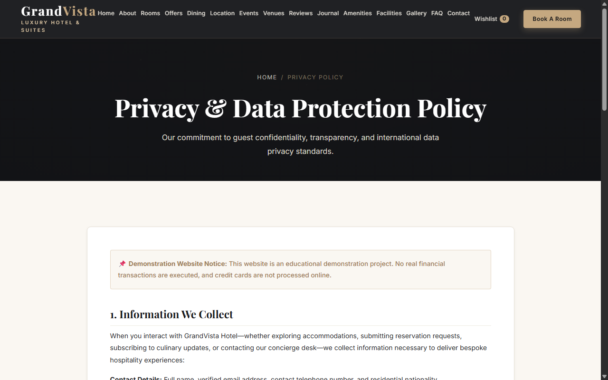 |

### Mobile Previews (375px Viewport)

| Mobile Home | Mobile Rooms | Mobile Booking | Mobile Location |
| :---: | :---: | :---: | :---: |
| 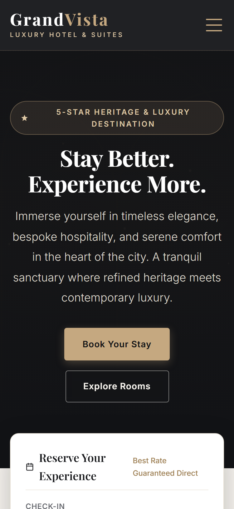 | 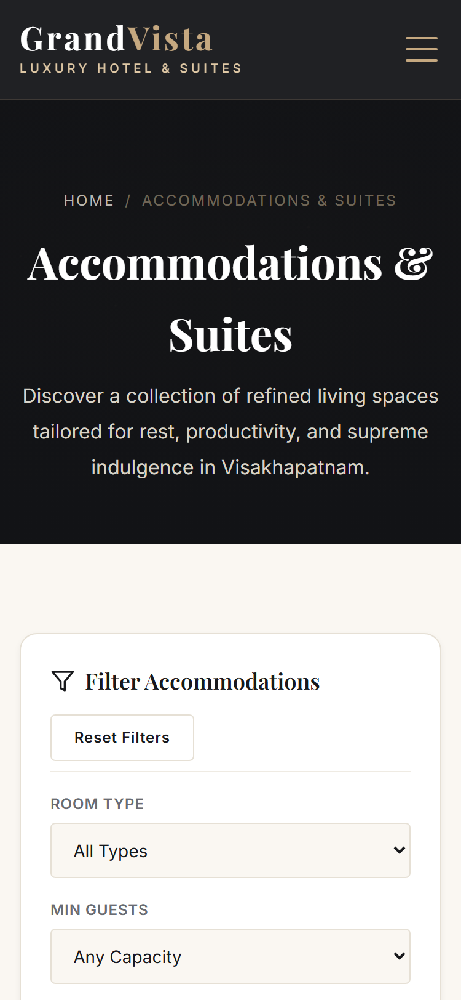 | 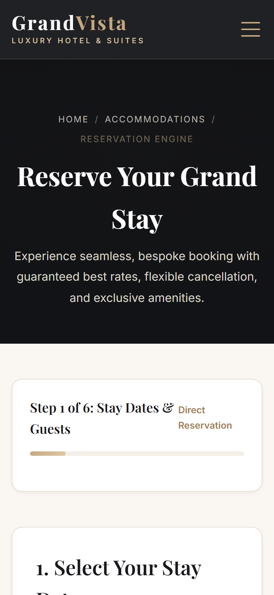 | 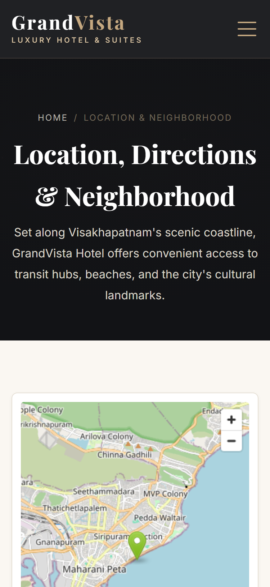 |

---

## ⚙️ Installation & Local Setup

### Prerequisites
- **PHP 8.2+** (PHP 8.5 recommended) with `pdo_mysql` extension enabled.
- **MySQL 8.0+** running locally.
- Modern web browser (Chrome, Edge, Firefox, Safari).

### 1. Clone the Repository
```bash
git clone https://github.com/Vikranth-Kumar-Jakkoju/grandvista-hotel.git
cd grandvista-hotel
```

### 2. Database Setup
1. Open your MySQL client and create the database:
   ```sql
   CREATE DATABASE grandvista_hotel CHARACTER SET utf8mb4 COLLATE utf8mb4_unicode_ci;
   ```
2. Import the canonical database schema and initial catalog seed:
   ```bash
   mysql -u root -p grandvista_hotel < backend/sql/schema.sql
   ```
3. Configure environment credentials:
   - Copy `backend/.env.example` to `backend/.env`:
     ```bash
     cp backend/.env.example backend/.env
     ```
   - Open `backend/.env` and update your MySQL credentials:
     ```env
     DB_HOST=localhost
     DB_PORT=3306
     DB_NAME=grandvista_hotel
     DB_USER=root
     DB_PASS=your_mysql_password
     ```
     *(Note: `backend/.env` is ignored by Git in `.gitignore` to prevent secret leaks).*

### 3. Run the Local Development Server
Start the built-in PHP development server from the project root directory:
```bash
php -S localhost:8000
```

### 4. Access the Website
Open your browser and navigate to:
```text
http://localhost:8000/
```

---

## 🔗 Backend API Endpoints

The backend provides clean RESTful JSON endpoints under `backend/api/`:

| Method | Endpoint | Description |
| :--- | :--- | :--- |
| `GET` | `/backend/api/rooms.php` | List all rooms or get specific room with `?slug=<slug>` |
| `GET` | `/backend/api/offers.php` | List active hotel special offers and packages |
| `GET` | `/backend/api/restaurants.php` | List dining venues or get specific restaurant with `?slug=<slug>` |
| `GET` | `/backend/api/menu-items.php` | Fetch menu items with optional filter `?restaurant_id=<id>` |
| `POST` | `/backend/api/booking.php` | Create room booking (server recomputes prices, nights, tax @ 18%) |
| `POST` | `/backend/api/contact.php` | Submit general concierge inquiry form |
| `POST` | `/backend/api/table-reservation.php` | Submit dining table reservation |

---

## 📄 License & Attribution

Designed and developed for GrandVista Hotel & Luxury Suites as part of the Web Development Internship at Netmaxin. All demo photography, illustrations, and trademarks belong to their respective creators or are custom SVG vector illustrations created for this project.
